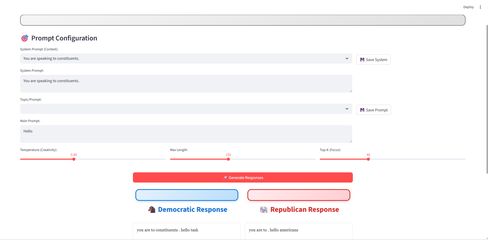

# Donkey vs Elephant

**Two GPT-2 language models fine-tuned on 20+ years of Congressional speech — one Democrat, one Republican — with a side-by-side comparison UI.**



Give both models the same prompt and watch how political language diverges. The "Donkey" model generates text in the style of Democratic legislators; the "Elephant" model speaks like a Republican. Same architecture, same training process, different data — the outputs reveal how partisan framing shapes political communication.

## How It Works

```
Congressional Record (2000-2024)
        │
        ▼
┌─────────────────┐
│  Data Collection │  ← Congress.gov API: speeches, remarks, floor statements
│  & Processing    │  ← Party classification via member lookup
└────────┬────────┘
         │
    ┌────┴────┐
    ▼         ▼
┌────────┐ ┌────────┐
│Democrat│ │Repub.  │
│ Corpus │ │ Corpus │
│(JSONL) │ │(JSONL) │
└───┬────┘ └───┬────┘
    │          │
    ▼          ▼
┌────────┐ ┌────────┐
│ Donkey │ │Elephant│  ← GPT-2 (124M) fine-tuned independently
│ Model  │ │ Model  │  ← Checkpoint/resume for multi-day training
└───┬────┘ └───┬────┘
    │          │
    └────┬─────┘
         ▼
   ┌───────────┐
   │  Web UI   │  ← Flask app, side-by-side generation
   │ Compare!  │  ← Configurable temperature, top-k, max length
   └───────────┘
```

## Project Structure

```
Donkey-Vs-Elephant/
├── data_collection/        # Congressional Record scraper & party classifier
│   ├── congress_api.py     # Congress.gov API client with rate limiting
│   ├── party_classifier.py # Speaker identification & party lookup
│   └── run_collection.py   # CLI orchestrator
├── model_training/         # GPT-2 fine-tuning pipeline
│   ├── dataset.py          # Custom Dataset with tokenization & chunking
│   ├── trainer.py          # Training loop with checkpoints & mixed precision
│   └── train.py            # CLI entry point (train one or both models)
├── web_ui/                 # Comparison interface
│   ├── app.py              # Flask backend with generation endpoints
│   └── templates/          # Political-themed responsive UI
├── scripts/                # Setup and convenience scripts
├── data/                   # (gitignored) Raw & processed datasets
├── models/                 # (gitignored) Trained model weights
└── logs/                   # (gitignored) Training logs
```

## Quick Start

### Prerequisites
- Python 3.10+
- CUDA-capable GPU (recommended for training; CPU works for inference)
- ~5 GB disk space for dataset + models

### Setup

```bash
git clone https://github.com/jakeaaronson/Donkey-Vs-Elephant.git
cd Donkey-Vs-Elephant
bash scripts/setup.sh
```

### Collect Data

```bash
source venv/bin/activate

# Full pipeline: download Stanford dataset (~2.8 GB), extract, and process
python -m data_collection.run_collection

# Or just the most recent congresses
python -m data_collection.run_collection --start-congress 110 --end-congress 114
```

### Train Models

```bash
# Train both models sequentially
python -m model_training.train --both --epochs 3

# Or train individually
python -m model_training.train --model donkey --epochs 3
python -m model_training.train --model elephant --epochs 3

# Resume from checkpoint after interruption
python -m model_training.train --model donkey --resume
```

Training times depend on data size and hardware. With a full dataset on a consumer GPU (RTX 3060–4090), expect 8–48 hours per model. The pipeline supports pause/resume — training can be interrupted and continued from the last checkpoint.

### Launch the UI

```bash
python -m web_ui.app
# Open http://localhost:5000
```

## Training Details

| Parameter | Value |
|-----------|-------|
| Base model | GPT-2 (124M parameters) |
| Tokenizer | GPT-2 BPE (50,257 vocab) |
| Max sequence length | 512 tokens |
| Optimizer | AdamW |
| Learning rate | 5e-5 with linear warmup |
| Precision | FP16 mixed precision |
| Checkpointing | Every 1,000 steps |

Both models start from the same pretrained GPT-2 weights and are fine-tuned independently on their respective party's corpus. This ensures any differences in output are attributable to the training data, not the model architecture or initialization.

## Data Source

Training data comes from the [Stanford Congressional Record dataset](https://data.stanford.edu/congress_text) (Gentzkow, Shapiro, & Taddy, 2019), which provides pre-parsed speeches from the 97th–114th Congresses (1981–2016) with speaker metadata and party affiliation already resolved.

The data collection pipeline:
1. Downloads `hein-daily.zip` (~2.8 GB) from Stanford's servers
2. Extracts pipe-delimited speech files and speaker maps
3. Joins speeches with speaker metadata (name, party, state, chamber)
4. Filters short procedural entries (< 50 words)
5. Splits into Democratic and Republican JSONL files for tokenization

**Why Stanford over the Congress.gov API?** The API returns metadata and links — not text. Speaker attribution requires fragile name-matching heuristics. The Stanford dataset solves both problems: full text with party labels pre-resolved against the `congress-legislators` database (92% name agreement rate, 99.7% speech boundary accuracy).

## Tech Stack

- **Python 3.10+** — Core language
- **PyTorch + HuggingFace Transformers** — Model fine-tuning and inference
- **HuggingFace Accelerate** — Mixed precision training
- **Flask** — Web UI backend
- **Congress.gov API** — Data source

## License

MIT
